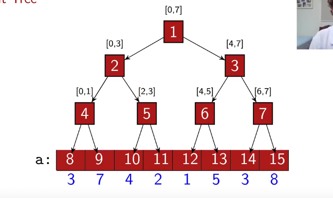

# SEG TREE

Estamos interessados em responder consultas sobre um array original;
Exemplo: 
* Responder o mínimo elemento presente em um subarray dado o primeiro e o último índice.


Observe que responder a soma de um subarray dado as mesmas condições é trivial é muito mais simples, basta utilizar a técnica de soma de prefixos. $O(n)$ de complexidade para construção do array de prefixos e $O(1)$ para as consultas. $\to O(n, 1)$


Interessante aqui é que para a construção da resposta é a combinação de dois valores.

A árvore de segmentos é uma estrutura de dados em que algumas queries são pré-computadas de maneira que qualquer outra querie pode ser obtida a partir de alguns nós da árvore.

* Utilização de uma numeração para identificar os nós: 1 -> raiz e assim vai. Note que conseguimos caminhar na árvore de tal maneira que o filho da esquerda $\to 2 i$ e o filho da direita $\to 2i + 1$.



Propriedades:
- 
* Altura da estrutura: $O(log(n))$;
* Número Total de nós: $ 2n-1$

* Tamanho do vetor da segtree: Podemos ter arrays de tamanho que não é potência de dois, assim a intuição é de que seria necessário da próxima potência de dois do tamanho para armazenar os nós da árvore. Ter buracos em algumas posições
```c++

int a[MAX];
int seg[4 * MAX]; 

// Contruir árvore na posição p
int build(int p, int l, int r){
     // Chegou na folha
    if(l == r) return seg[p] = v[l];

    int m = (l + r)/2;

    // Contrua para os filhos
    return seg[p] = min(build(2 * p, l, m), build(2 * p + 1, m + 1, r));

}

build(1, 0, n -1); // Retorna  o min do array inteiro

```

* Contrução: $O(n)$
* Consulta:
```c++
// Quero a query de a até b (o que queremos perguntar)
// posição da segtree, l e r o que aquele nó representa
int query(int a, int b, int p, int l, int r){

    // Intervalos disjuntos
    if( b < l or r > a)
 return INF;
    
    //Inteiramente contido
    if(a <= l and r <= b) return seg[p];

    // Nas bordas
    int m = (l + r)/2;
    return min(query(a, b, 2 * p, l, m), query(a, b, 2 * p + 1, m + 1, r));

}

cout << query(a, b, 1, 0, n - 1) << endl;


```

* Visitamos no máximo 4 nós por nível. $O(4 \log n) \to O(\log n)$. Afinal, apenas os nós das fronteiras podem decer na árvore.


### Atualização da Estrutura

```c++
// Índice a ser atualizado, novo valor
int update(int i, int x, int p, int l, int r){

    if(i < l or i > r) return seg[p]; // Disjunto
    if(l == r) return seg[p] = x; // folha l == r == i

    int m = (l+r)/2;
    return seg[p] = min(update(i, x, 2*p, l, m), update(i, x, 2*p + 1, m + 1, r));

}

update(i, x, 1, 0, n-1); // Muda o valor da posição i para o valor x

```

* Podemos obter o mesmo resultado da Soma de prefixos em tempo mais rápido.

* Funciona para qualquer operação associativa.


## Lazy Propagation
Utilizada em problemas quando temos que atualizar não somente um único elemento do array principal (Para nós aqui, vértices folhas), mas um subarray inteiro. 

Queremos propagar as variações até termos um nó que representa um intervalo inteiramente contido no intervalo de interesse. Ao "querer" um intervalo mais restrito e o nó atual já possui uma variação gravada nele temos que decer a variação mais um nível.

* A técnica consiste em gravar em um array de propagação as futuras propagações que devem ser feitas.

### Problema 1
 Dado um vetor inicialmente zerado de $n$ posições, efetue as seguintes operações:

    Operação 1: troque todos os valores nas posições do vetor no intervalo de l à r para o inteiro x, com 1≤x≤109.

    Operação 2: imprima o valor máximo do vetor no intervalo de l à r.

```c++
// Propagation of deltas
void unlazy(int p, int a, int b){

    if(lz[p] == 0) return; // Sem propagacao

    if(a != b){ // Nao eh folha
        lz[2 * p] += lz[p];
        lz[2 * p + 1] += lz[p];
    }
    lz[p] = 0;
}

// Update a range by +x in this case
int update(int a, int b, int x, int p, int l, int r){
   // unlazy(p, a, b);

    if(b < l or a > r) return seg[p]; // Disjuntos
    if(a <= l and r <= b){
        lz[p] += x;
        //unlazy(p, a, b); // Why???
        return seg[p]; // Aqui pode dar problema
    }

    unlazy(p, l, r);

    int m = (l + r)/2;
    return seg[p] = update(a, b, x, 2*p, l, m) + update(a, b, x, 2*p + 1, m + 1, r);

}

int query(int a, int b, int p, int l, int r ){
    if(r < a or b < l) return 0;
    if(a <= l and r <= b) return seg[p] + lz[p]; // Cobre o caso da folha


    unlazy(p, l, r);

    int m = (l + r)/2;
    return query(a, b, 2*p, l, m) + query(a, b, 2*p + 1, m + 1, r);

}


```


